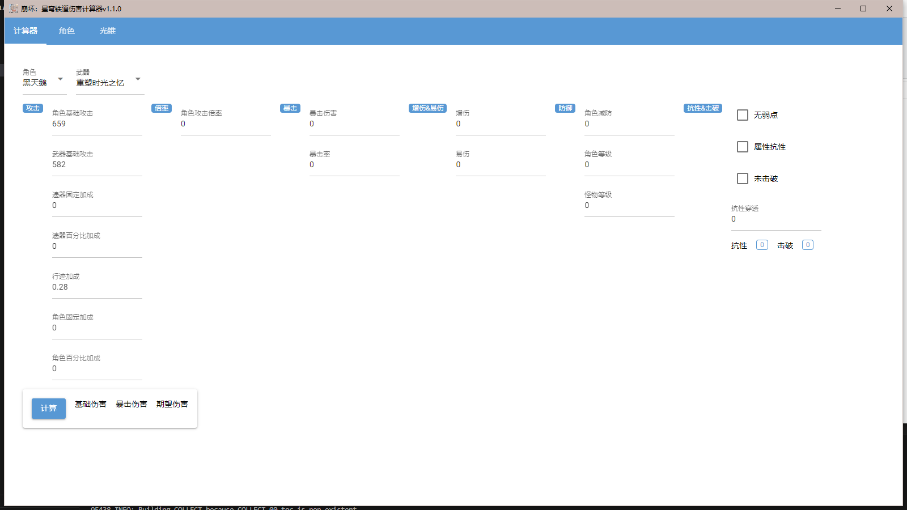
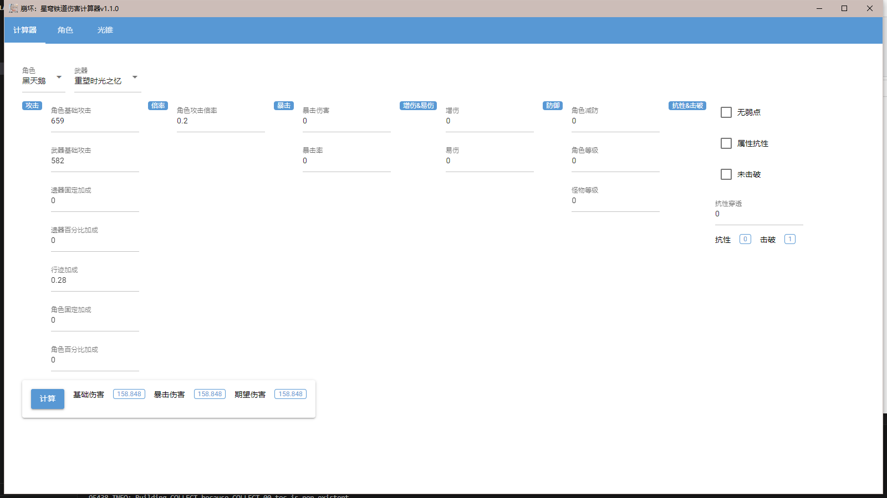
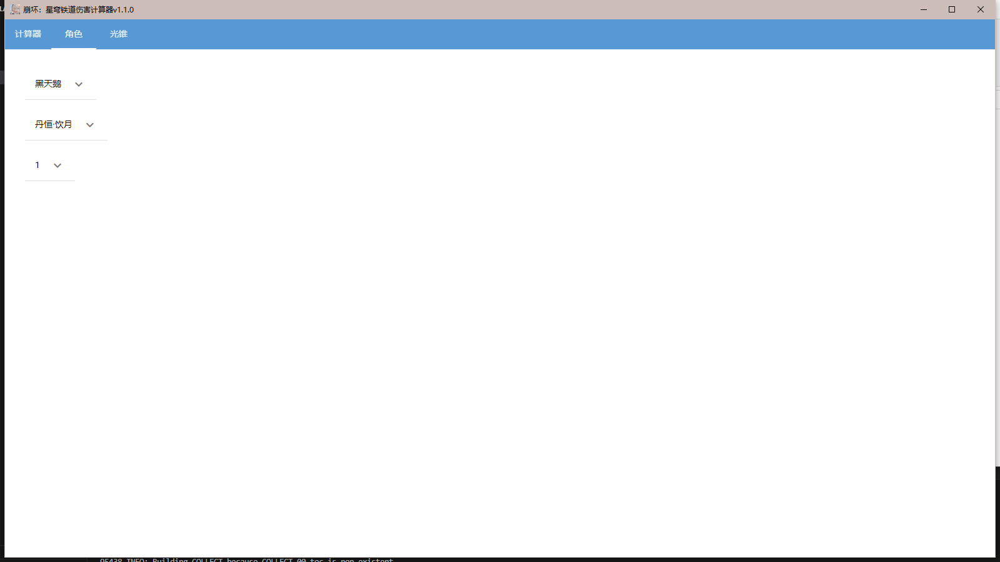
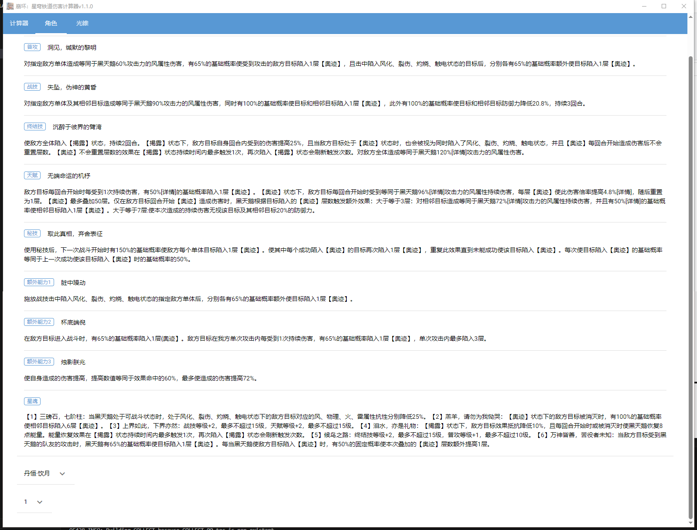
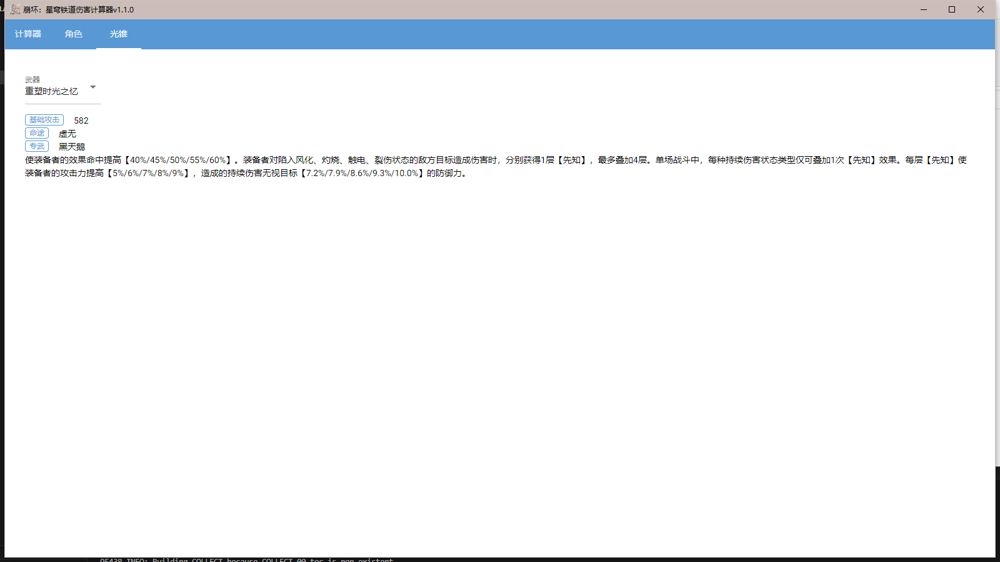
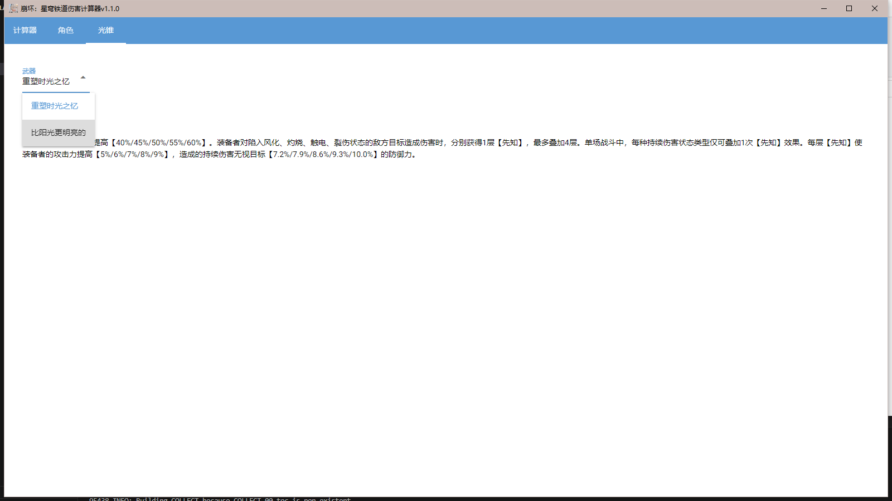

# Star Rail Calculator | 崩坏：星穹铁道伤害计算器

## 简介

基于[NiceGUI](https://nicegui.io)的崩坏：星穹铁道伤害计算器

### Features

- 支持自定义角色、光锥、星魂、遗器

- 支持自定义计算数值

- 本地数据存储

- 内置角色、光锥等界面，数据皆来自官方wiki

### Usage

#### build

```

python build.py

# 复制data文件夹到编译后的可执行文件同级目录

```

#### web

`http://127.0.0.1:3334`

### 界面预览






